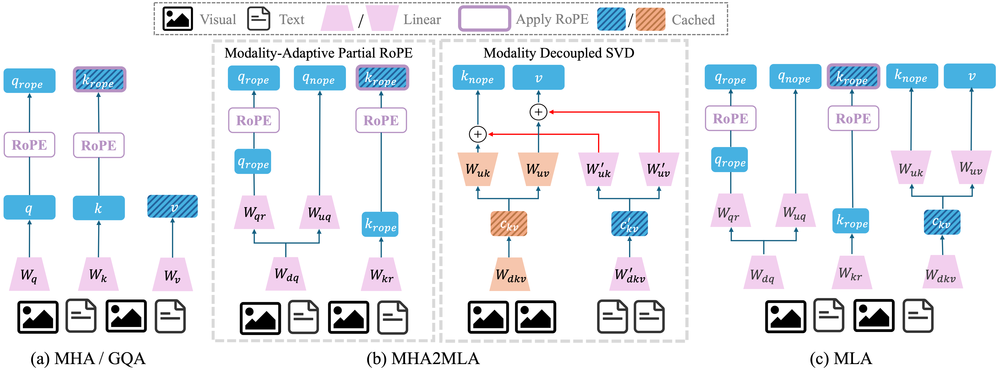

# MHA2MLA-VLM


This repo contains the code for the paper: **Enabling DeepSeek's Economical Multi-Head Latent Attention across Vision-Language Models**



Our code supports three representative VLMs: 
- LLaVA-1.5: llava-hf/llava-1.5-7b-hf
- LLaVA-NeXT: llava-hf/llama3-llava-next-8b-hf 
- Qwen2.5-VL: Qwen/Qwen2.5-VL-7B-Instruct


## News

<!-- - [2025.02.2] The paper of MHA2MLA-VLM is publicly available:  -->
- [2026.01.22] The three [MLA checkpoints](https://huggingface.co/cnxup/models) ($d_{kv}$=32/64/128) derived from `Qwen2.5-VL-7B` are publicly available.
- [2026.01.17] Released the MHA2MLA-VLM code, providing usage code for VLMs fine-tuning and evaluations.


## Datasets

We use different datasets for different models:

| Model | Dataset |
|-------|---------|
| LLaVA-1.5 | [LLaVA-Instruct](https://huggingface.co/datasets/liuhaotian/LLaVA-Instruct-150K/tree/main) |
| LLaVA-NeXT | [LLaVA-NeXT-Data](https://huggingface.co/datasets/lmms-lab/LLaVA-NeXT-Data) |
| Qwen2.5-VL | [LLaVA-NeXT-Data](https://huggingface.co/datasets/lmms-lab/LLaVA-NeXT-Data) |


## Environment

Install pytorch and other packages.

```sh
conda create -n mha2mla-vlm python=3.11
pip install torch==2.4.0 torchvision==0.19.0
pip install -r requirements.txt
```

## Train
### 1. Stage-1 Partial-RoPE training


```sh
cd llava/llavanext/qwen2_5_vl
sh scripts/stage1.sh
```

### 2. MD-SVD Init
Before the stage 2 training, you need to run the MD-SVD that we proposed. After the running is completed, the initial weights of MD-SVD will be output to the ``output_path``.
```sh
cd llava/llavanext/qwen2_5_vl
sh scripts/run_svd_init.sh
```


### 3. Stage-2 Training

```sh
cd llava/llavanext/qwen2_5_vl
sh scripts/stage2.sh
```

## Evaluation
Our evaluation is based on [lmms-eval](https://github.com/EvolvingLMMs-Lab/lmms-eval). To implement the evaluation of MHA2MLA-VLM, we modified the  ``lmms-eval/lmms_eval/models/llava_hf.py`` and ``lmms-eval/lmms_eval/models/qwen2_5_vl.py``.

For the baseline evaluation, you can use the following command:

```sh
cd eval
cd llava/llavanext/qwen2_5_vl
sh eval.sh
```

If you want to use the quantized KV cache, you can use the following command:

```sh
cd eval/llavanext
sh eval_quant.sh
```

## Citation

```bibtex
@misc{fan2026mha2mlavlmenablingdeepseekseconomical,
      title={MHA2MLA-VLM: Enabling DeepSeek's Economical Multi-Head Latent Attention across Vision-Language Models}, 
      author={Xiaoran Fan and Zhichao Sun and Tao Ji and Lixing Shen and Tao Gui},
      year={2026},
      eprint={2601.11464},
      archivePrefix={arXiv},
      primaryClass={cs.CV},
      url={https://arxiv.org/abs/2601.11464}, 
}
```
